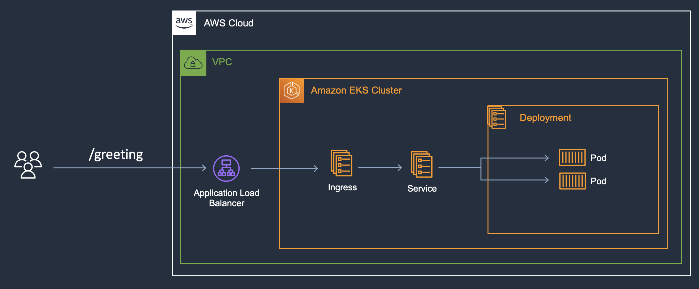

## Build with AWS CDK & CDK8s | AWS re:Invent 2021

Demo application used to demonstrate the [AWS CDK](https://aws.amazon.com/cdk/) and [CDK8s](https://cdk8s.io/) working side by side. 

> This application was presented at AWS re:invent 2021 | CON312

## Story

In this application, we show how a Java developer can utilize the AWS CDK and CDK8s, 
to easily containerize and deploy a springboot application onto a Kubernetes cluster.

All done within the same code base, using the same programming language, and leveraging standard
software engineering practices.

## Components

This application includes the following:

1. SpringBoot MVC application.
2. Kubernetes manifest, defined via code with CDK8s, that deploys the app to a Kubernetes cluster.
3. CloudFormation stack, defined via code with AWS CDK, that deploys an EKS cluster with an ALB Controller.

## Architecture

A Diagram is worth a thousand words:

## Usage

All operations in this application are invoked via the `Makefile`, which contains some useful targets.

- `make deploy`: Compile and deploy the application. 
- `make destroy`: Destroy the application.
- `make stack`: Synthesize the CloudFormation stack into `cdk.out` directory.
- `make manifest`: Synthesize the Kubernetes manifest into `dist` directory.
- `make install`: Install application dependencies.
- `make run`: Run the application locally.
- `make container`: Run the application locally inside a container.
- `make kill`: Kill the local container.
- `make jar`: Package the application into a JAR file.
- `make image`: Package the application into a Docker image and upload to ECR.

## Security

See [CONTRIBUTING](CONTRIBUTING.md#security-issue-notifications) for more information.

## License

This project is licensed under the Apache-2.0 License.

